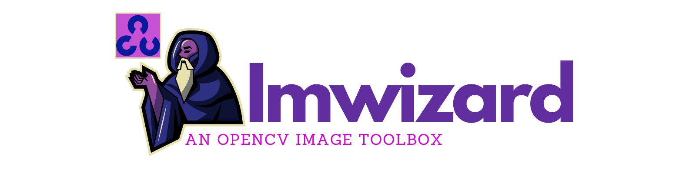

# imwizard
Python utilities for image processing with OpenCV.




#### _Introduction_

In my effort to learn computer vision with OpenCV and Python I always incur in some common tasks I need to accomplish before diving into the real juice of each project. Image preprocessing is always needed when working with images. Most of the times this ecompass different actions:

* changing image format
* resizing
* thresholding
* edging
* contour detection
* many more

I use to write a function each time I end up doing a copy+paste of a snippet more than 2/3 times. I am italian, I don't want to spend time copy pasting code. It's a waste of time I can spend to take a good coffee. But I am also a physicist with some efficiency obsessions. I'm scared to death one day I will write a so messy and inefficient code that the world will crash. Or worse, I would have to pass entire days modifying all the code I wrote. I try to keep it clean, commented, compact and modular.

So I put every utility function I use in my Computer Vision projects in ```imwizard```, my own version of OpenCV Python toolbox. And sincerely, I use it a lot! I have a passion for graphics too, so I always make some logos or banners for my READMEs...don't take it too seriously! it's just a creative caprice.

#### _Desciption_

Here follows a description of the main methods and classes that are so far implemented.

```python 
def create_contour_mask(c,img):
``` 
given an imput contour ```c``` and an image ```img```,returns a mask for the contour.

```python
def contour_center(c):
``` 
given an imput contour ```c```, returns a tuple with the (x,y) coordinates of the contour center.

```python
def process_contours(cnts,image):
``` 
given an imput list of contours ```cnts``` and an image ```image```, returns a dictionary ```obj={"centers":[],"area":[],"masks":[],"mean":[],"std":[]}``` with the center coordinates, areas, masks, mean value and stadard deviation of each contour.

```python
def mean_std(image,mask):
``` 
given an imput image ```image``` and a mask ```mask```,returns the pixel (r,g,b) mean and standard deviation of the masked image in the form of a 2-tuple ```(mean,std)```.

```python
min_dist(mean1,mean2):
``` 
given an imput (r,g,b) color ```mean2``` and a list of (r,g,b) colors ```mean1```, computes the Euclidean distances in the L*a*b* space between each color and returns a 2-tuple 
```(d,i)``` with distance and index of the minimum.

```python
def create_shade_square(mean,std,h,w,library="plotly"):
``` 
given an input 3-tuple with ```mean``` (r,g,b) values and a 3-tuple with ```std``` (r,g,b) standard deviation, creates a numpy array of shape ```h,w``` mean color ```mean```, linearly distributed between ```mean+/-std```. ```library``` parameter can be set to ```cv2``` in order to generate an output image compatible with OpenCV channel convention (BGR instead of RGB). 

```python
def plot_shade(mean,std,library="plotly"):
``` 
given an input 3-tuple with ```mean``` (r,g,b) values and a 3-tuple with ```std``` (r,g,b) standard deviation, plot a box 300x600 using the image from ```create_shade_square```. ```library``` parameter can be set to ```cv2``` to plot the image with OpenCV.

```python
show_image_masked(image,mask):
``` 
given an imput image ```image``` and a mask ```mask```, plot the masked image with OpenCV.

```python
scale_image(image,scale_percent=60):
``` 
given an imput image ```image``` rescale the image by ```scale_percent```. Default is 60% rescaling.

```python
def manual_thresholder(image):  
```
given an imput image ```image```, create an OpenCV image with trackbars that control the thresholding level of the image. When ```x``` key is pressed, a mask with the thresholded region is returned. 

```python
class SquareSelector():
  def __init__(self,image):
```
shows the input image and writes rectangles on user selected areas when the ```square_selector()``` function is called. After all the areas are selected, pressing the ```c``` key validates the selection and a mask with the selected areas are returned. Built-in undo logic to revert changes: pressing the ```r``` key reverts the last change made. Pressing ```r``` n-times will revert to the nth previous change made.

```python
class ColorFilter():  
  def __init__(self,image):
```
shows the input image with trackbars ```(rmin,gmin,bmin)``` and ```(rmax,gmax,bmax)``` when the ```color_filter()``` function is called. The trackbars values allow to filter the image by selecting only the rgb values between the trackbar values. Pressing the ```q``` key validates the selection and a list ```[(rmin, gmin, bmin), (rmax, gmax, bmax)]``` is returned.


